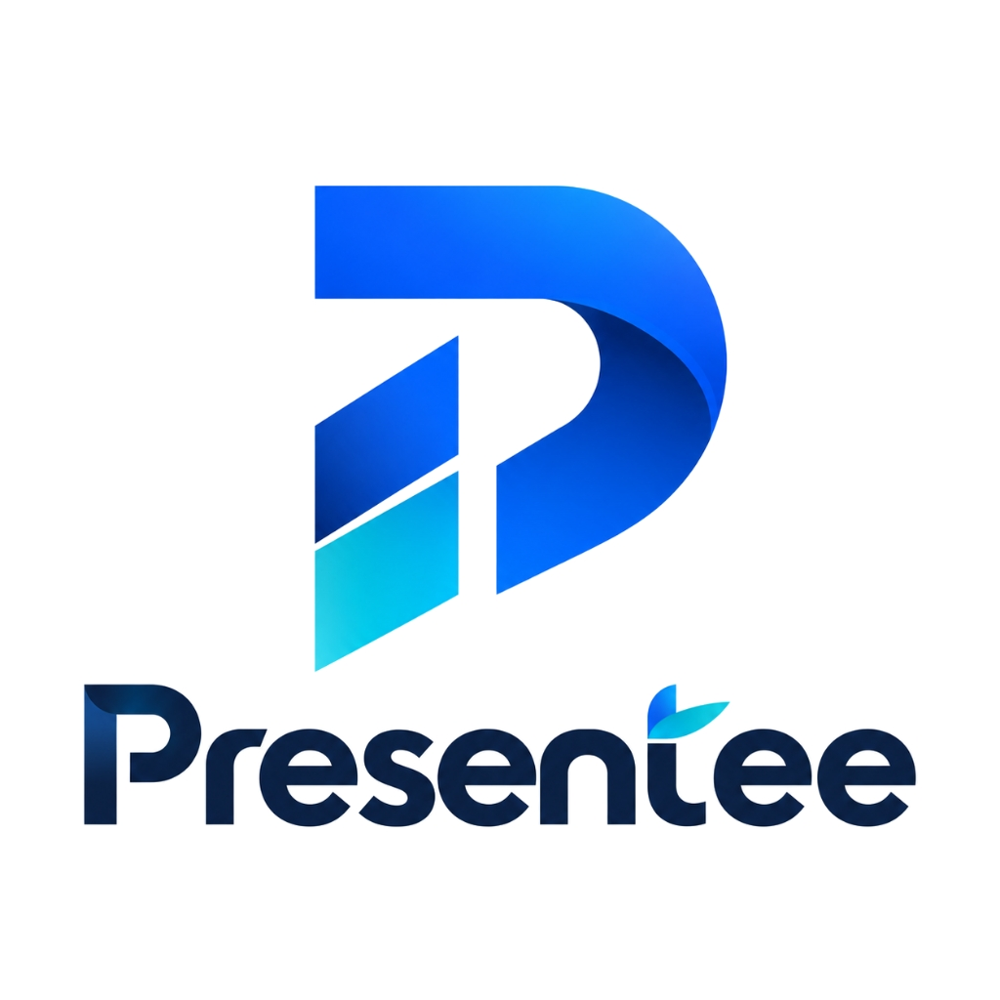
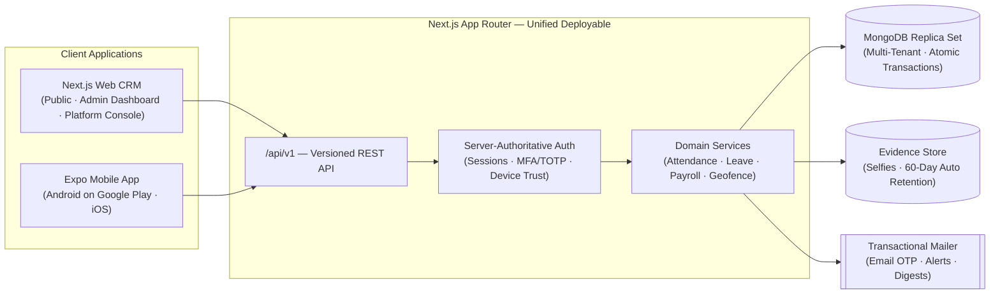

<p align="center">
  
</p>

<h1 align="center">Presentee</h1>
<p align="center"><b>Smart attendance and payroll management for modern teams</b></p>

<p align="center">
  <a href="https://presentee.ashwanitiwari.com"></a>
  <a href="https://play.google.com/store/apps/details?id=com.presentee.app"></a>
  
  
  
  
  
  
</p>

<p align="center">
  <a href="https://presentee.ashwanitiwari.com"><b>🌐 Launch Live Web App</b></a> &nbsp;&bull;&nbsp;
  <a href="https://play.google.com/store/apps/details?id=com.presentee.app"><b>📱 Download on Google Play Store</b></a>
</p>

<p align="center">
  A full-stack, multi-tenant attendance and workforce operations platform designed and built end to end — the public marketing website, self-serve company onboarding, an extensive CRM-style admin dashboard, a platform-owner console, a versioned REST API, and a native Android/iOS mobile employee app, all sharing one unified authorization model and design system.
</p>

> [!NOTE]
> **About this Preview Repository.** Presentee's source code is hosted in a private repository as it powers an active commercial production service. This public repository serves as an architectural walkthrough, UI preview, and documentation of the platform's features, flows, and engineering design. Both the [Live Web Platform](https://presentee.ashwanitiwari.com) and the [Google Play Store App](https://play.google.com/store/apps/details?id=com.presentee.app) are active and in production.

---

## Table of Contents

- [What It Does](#what-it-does)
- [Who It's For](#who-its-for)
- [System Architecture](#system-architecture)
- [Step-by-Step UI Tour & Page Walkthrough](#step-by-step-ui-tour--page-walkthrough)
  - [1. Authentication & Onboarding](#1-authentication--onboarding)
    - [1.1 Login & Sign In (`/login`)](#11-login--sign-in-login)
    - [1.2 Create Workspace / Registration (`/register`)](#12-create-workspace--registration-register)
  - [2. Company Admin Web CRM (`/app`)](#2-company-admin-web-crm-app)
    - [WORKSPACE](#workspace)
      - [2.1 Overview & Live Dashboard (`/app`)](#21-overview--live-dashboard-app)
      - [2.2 Employee Directory (`/app/employees`)](#22-employee-directory-appemployees)
      - [2.3 Live Attendance Board (`/app/attendance`)](#23-live-attendance-board-appattendance)
      - [2.4 Device Approvals & Hardware Binding (`/app/devices`)](#24-device-approvals--hardware-binding-appdevices)
      - [2.5 Manual Attendance Corrections (`/app/manual-attendance`)](#25-manual-attendance-corrections-appmanual-attendance)
      - [2.6 Leave Management & Approvals (`/app/leave`)](#26-leave-management--approvals-appleave)
    - [INSIGHTS](#insights)
      - [2.7 Reports & Analytics (`/app/reports`)](#27-reports--analytics-appreports)
      - [2.8 Automated Payroll Engine (`/app/payroll`)](#28-automated-payroll-engine-apppayroll)
    - [SETUP](#setup)
      - [2.9 Workplace & Geofence Configuration (`/app/configuration`)](#29-workplace--geofence-configuration-appconfiguration)
    - [ACCOUNT](#account)
      - [2.10 Billing & Subscriptions (`/app/billing`)](#210-billing--subscriptions-appbilling)
      - [2.11 In-App Notifications (`/app/notifications`)](#211-in-app-notifications-appnotifications)
      - [2.12 Help & Support Center (`/app/support`)](#212-help--support-center-appsupport)
      - [2.13 Workspace Settings (`/app/settings`)](#213-workspace-settings-appsettings)
  - [3. Native Mobile App (Android & iOS)](#3-native-mobile-app-android--ios)
    - [3.1 One-Tap Check-In & Multi-Factor Verification](#31-one-tap-check-in--multi-factor-verification)
    - [3.2 Attendance History & Monthly Breakdown](#32-attendance-history--monthly-breakdown)
    - [3.3 Mobile Leave Application](#33-mobile-leave-application)
    - [3.4 Admin Approvals on the Go](#34-admin-approvals-on-the-go)
  - [4. Platform Owner / Super Admin Console](#4-platform-owner--super-admin-console)
- [Feature Highlights](#feature-highlights)
- [Tech Stack](#tech-stack)
- [Engineering Practices](#engineering-practices)
- [Author & Background](#author--background)

---

## What It Does

Presentee replaces the manual, easily falsified spreadsheet-and-messaging workflows that small and growing companies use to track workforce attendance. 

Employees clock in and out from their mobile devices; the server — **never the client** — authorizes whether a check-in is authentic and valid through a multi-layered verification pipeline:

- **📍 Geofenced GPS Validation** — Attendance records are only accepted when the employee's verified location is within the configured office perimeter radius.
- **🤳 Live Selfie Evidence** — Captures a live, front-camera photo directly at the timestamp of check-in with automatic 60-day privacy retention cleanup.
- **📱 Single-Device Hardware Binding** — Enforces a strict one-approved-device-per-employee rule; switching to a new phone requires explicit administrator review.
- **🔒 On-Device Biometric Confirmation** — Leverages native OS biometric hardware (fingerprint or Face ID) verified locally by the operating system without sensitive biometric data touching the server.

Admins get a single real-time dashboard displaying who is present, who arrived late, and who is absent, alongside automated payroll processing, exception correction, and leave management.

---

## Who It's For

| Role | Interface | Capabilities |
|---|---|---|
| **Employee** | Mobile App (Android & iOS) | One-tap check-in/out, geofence status feedback, biometric confirmation, leave applications, attendance history calendars, and in-app alerts. |
| **Company Admin** | Web CRM & Mobile App | Comprehensive browser dashboard + on-the-go mobile approval hub: live attendance logs, employee directory, device & leave approvals, manual punch overrides, shift rules, and payroll processing. |
| **Platform Owner** | Dedicated Super Admin Console | Independent, explicitly-authorized operations console for multi-tenant company provisioning, subscription management, payment auditing, and support triage. |

---

## System Architecture



### Key Architectural Tenets

1. **Single Deployable, Zero Microservice Sprawl** — The marketing site, admin CRM, platform console, and versioned `/api/v1` backend live within a single Next.js App Router application.
2. **Server-Authoritative Verification** — All timestamps, GPS geofence calculations, and shift grace period checks are computed against the server's atomic clock and verified on the backend.
3. **Strict Multi-Tenant Isolation** — Every query and transaction is explicitly scoped to the authenticated tenant workspace with zero data leakage across companies.
4. **Multi-Document Atomic Transactions** — Powered by MongoDB replica set transactions to guarantee atomic consistency during multi-step events like workspace registration and punch processing.
5. **Native Mobile Client** — Built with React Native and Expo 57, delivering hardware access for camera, GPS, and biometrics while sharing validation schemas with the server.

---

## Step-by-Step UI Tour & Page Walkthrough

Explore every screen of Presentee, including the public onboarding flows, the complete Company Admin CRM navbar options, the Google Play mobile app, and the platform owner console.

```
📁 Presentee Platform Navigation
├── 🔐 1. Authentication & Onboarding
│   ├── 1.1 Sign In / Login (/login)
│   └── 1.2 Create Workspace (/register)
├── 🏢 2. Company Admin Web CRM (/app)
│   ├── WORKSPACE
│   │   ├── 2.1 Overview & Live Dashboard (/app)
│   │   ├── 2.2 Employee Directory (/app/employees)
│   │   ├── 2.3 Live Attendance Board (/app/attendance)
│   │   ├── 2.4 Device Approvals & Hardware Binding (/app/devices)
│   │   ├── 2.5 Manual Attendance Corrections (/app/manual-attendance)
│   │   └── 2.6 Leave Management & Approvals (/app/leave)
│   ├── INSIGHTS
│   │   ├── 2.7 Reports & Analytics (/app/reports)
│   │   └── 2.8 Automated Payroll Engine (/app/payroll)
│   ├── SETUP
│   │   └── 2.9 Workplace & Geofence Configuration (/app/configuration)
│   └── ACCOUNT
│       ├── 2.10 Billing & Subscriptions (/app/billing)
│       ├── 2.11 In-App Notifications (/app/notifications)
│       ├── 2.12 Help & Support Center (/app/support)
│       └── 2.13 Workspace Settings (/app/settings)
├── 📱 3. Native Mobile App (Google Play Store)
│   ├── 3.1 One-Tap Check-In & Multi-Factor Verification
│   ├── 3.2 Attendance History & Monthly Breakdown
│   ├── 3.3 Mobile Leave Application
│   └── 3.4 Admin Approvals on the Go
└── 🛡️ 4. Super Admin / Platform Owner Console
```

---

### 1. Authentication & Onboarding

#### 1.1 Login & Sign In (`/login`)

The gateway to the company workspace. Built with flexible authentication modes to accommodate various organizational security policies.

- **Dual-Mode Sign In**: Toggle between standard Work Email + Password or passwordless Email OTP verification codes.
- **Workspace Redirection**: Automatically directs authenticated users to their specific company tenant dashboard.
- **Account Recovery**: Integrated self-serve password reset workflows.
- **Onboarding Link**: Direct routing for new organizations to initialize a workspace.


---

#### 1.2 Create Workspace / Registration (`/register`)

Instant self-serve company onboarding designed to have an organization up and running with smart attendance in under 60 seconds.

- **Rapid Setup**: Requires only Company Name, Admin Full Name, Work Email, and Master Password.
- **Starter Tier**: Free forever for teams of up to 2 employees to allow immediate testing without friction.
- **Transparent Commercials**: Clear ₹100/employee/month pricing with no upfront credit card requirement.
- **Automated Workspace Provisioning**: Initializes tenant database collections, default shifts, geofence templates, and administrator credentials in a single atomic transaction.


---

### 2. Company Admin Web CRM (`/app`)

The administrative heart of Presentee. The web application features a streamlined sidebar navigation categorized into **Workspace**, **Insights**, **Setup**, and **Account**.

---

#### WORKSPACE

#### 2.1 Overview & Live Dashboard (`/app`)

The daily command center for company leadership and HR managers, giving an instantaneous pulse of company attendance.

- **Key Real-Time KPI Cards**:
  - `PRESENT TODAY`: Real-time count of staff checked in within the geofenced perimeter.
  - `LATE ARRIVALS`: Employees who punched in past the configured shift grace period.
  - `CHECKED OUT`: Staff members who have completed their daily shift.
  - `ON LEAVE`: Employees with approved leave for the current date.
- **Actionable Alert Banners**: Urgent notifications, such as *“Device approvals waiting — 1 employee cannot mark attendance until you review their device”* with direct quick-action links.
- **14-Day Attendance Graph**: Visual stacked histogram illustrating historical attendance rates day by day.
- **Needs Your Attention**: Curated queue highlighting pending device verifications and unreviewed manual punches.


---

#### 2.2 Employee Directory (`/app/employees`)

The centralized employee management system for organizing staff, assigning roles, and managing workspace permissions.

- **Staff Roster Table**: Filterable list containing employee avatars, names, work email addresses, departments, and active employment status.
- **Role-Based Access Control**: Easily designate team members as standard `Employee` or `Company Admin`.
- **Employee Onboarding**: Invite new team members via email with auto-generated onboarding links.
- **Profile & Device Status**: Inspect individual employee details, assigned shifts, bound hardware devices, and attendance summaries.


---

#### 2.3 Live Attendance Board (`/app/attendance`)

The granular audit feed showing every single check-in and check-out event across the organization.

- **Real-Time Punch Feed**: Live chronological record of every employee check-in and check-out timestamp.
- **Verification Badges**: Visual indicators confirming GPS geofence compliance, biometric verification pass, and device trust.
- **Selfie Evidence Inspection**: Modal preview of the captured front-facing camera verification selfie taken at the punch timestamp.
- **Granular Filtering**: Search by employee name, filter by date range, department, or attendance status (On Time, Late, Early Departure).


---

#### 2.4 Device Approvals & Hardware Binding (`/app/devices`)

The core hardware trust engine preventing buddy punching and proxy attendance.

- **Single Device Policy**: Enforces that each employee may only mark attendance from their designated, approved smartphone.
- **Pending Approvals Queue**: Live badge counter in the navigation bar alerting admins to newly registered devices awaiting approval.
- **Device Metadata Inspection**: Displays operating system (Android/iOS), phone model, device UUID hash, and registration timestamp.
- **Binding Controls**: One-click actions to Approve, Reject, or Revoke device bindings when an employee changes or replaces their phone.


---

#### 2.5 Manual Attendance Corrections (`/app/manual-attendance`)

The structured exception handling system for resolving missed punches and technical contingencies.

- **Admin Manual Punch Creation**: Admins can log check-in/out events on behalf of employees with mandatory justification remarks.
- **Employee-Raised Punch Requests**: Review manual punch requests submitted directly by employees from the mobile app (e.g., client site visits).
- **Immutable Audit Trail**: Logs the admin editor's identity, timestamp of modification, and reason for adjustment to prevent payroll disputes.


---

#### 2.6 Leave Management & Approvals (`/app/leave`)

The unified portal for tracking team availability, leave balances, and formal absence requests.

- **Leave Request Inbox**: Queue of pending time-off submissions displaying employee name, leave type, start/end dates, and reason notes.
- **One-Click Decision Flow**: Approve or decline leave requests with optional feedback remarks.
- **Leave Category Tracking**: Manage different categories such as Casual Leave (CL), Sick Leave (SL), and Paid Time Off (PTO).
- **Team Availability Calendar**: Month-level view highlighting scheduled absences to prevent staffing shortages.


---

#### INSIGHTS

#### 2.7 Reports & Analytics (`/app/reports`)

High-level analytics and exportable compliance reports for management, operations, and HR auditing.

- **Attendance Trend Metrics**: Visual graphs indicating company-wide punctuality rates, absenteeism rates, and average working hours.
- **Departmental Comparisons**: Compare attendance compliance across engineering, operations, marketing, and sales.
- **Custom Date Range Filtering**: Generate reports for specific weeks, monthly cycles, or quarterly reviews.
- **Export Capabilities**: One-click download of attendance datasets in CSV and PDF formats for external recordkeeping.


---

#### 2.8 Automated Payroll Engine (`/app/payroll`)

An intelligent payroll engine that directly consumes validated attendance data to generate payroll-ready salary sheets.

- **Attendance-Driven Calculations**: Eliminates manual spreadsheets by translating punch records and approved leaves into billable hours.
- **Precise Hourly Overtime Calculation**: Overtime is calculated and compensated strictly on an hourly basis.
- **Fair Hourly Late Deductions**: Late arrivals past grace periods are calculated proportionally per hour rather than blunt arbitrary percentage cuts.
- **Monthly Salary Generation & Export**: Preview monthly payouts, review adjustments, and export complete payroll CSV files ready for banking disbursement.


---

#### SETUP

#### 2.9 Workplace & Geofence Configuration (`/app/configuration`)

The operational rulebook configuring physical office locations, work shifts, and verification strictness.

- **Office Geofence Perimeter**: Set office latitude and longitude coordinates with a configurable radius (e.g., 50m–200m) on an interactive map.
- **Shift Timings & Grace Periods**: Define working hours (e.g., 09:30 AM to 06:30 PM) and late-arrival grace period thresholds (e.g., 15 minutes).
- **Verification Policy Toggles**: Choose which verification factors are mandatory:
  - Require GPS Geofence Check (Yes/No)
  - Require Selfie Photo Evidence (Yes/No)
  - Require On-Device Biometric Unlock (Yes/No)
  - Strict Device Hardware Binding (Yes/No)


---

#### ACCOUNT

#### 2.10 Billing & Subscriptions (`/app/billing`)

Transparent workspace seat management and subscription billing.

- **Active Employee Usage Meter**: Real-time counter of billable active employees in the current billing cycle.
- **Transparent Tier Pricing**: Clear breakdown of the 2-employee free tier and ₹100/employee/month active seat charges.
- **Invoices & Receipts**: Complete download history of past invoices and payment receipts.
- **Payment Method Management**: Self-serve portal for payment methods and subscription status.


---

#### 2.11 In-App Notifications (`/app/notifications`)

The centralized activity stream keeping administrators informed of critical workspace actions.

- **System Alert Feed**: Consolidated feed of newly requested device authorizations, submitted leave applications, and geofence exceptions.
- **Unread Status Badging**: Instant visual cue in the navigation bar when pending items require attention.
- **Direct Navigation**: Clicking any notification item navigates straight to the relevant review screen.


---

#### 2.12 Help & Support Center (`/app/support`)

Dedicated support interface for workspace admins to get immediate assistance.

- **Ticket Submission**: Submit technical queries or configuration requests directly from the app.
- **Knowledge Base Documentation**: Quick links to onboarding guides, geofence calibration tips, and hardware troubleshooting.
- **Priority Channel**: Direct line to platform support for payment or operational assistance.


---

#### 2.13 Workspace Settings (`/app/settings`)

Organization-wide branding, regional localization, and security credentials.

- **Company Identity**: Update company legal name, brand logo, and administrative contact email.
- **Timezone & Localization**: Configured to the organization's regional timezone (e.g., `Asia/Kolkata`) to guarantee clock synchronization across all clients.
- **Security & MFA**: Manage two-factor authentication (MFA/TOTP) requirements for administrative accounts.


---

### 3. Native Mobile App (Android & iOS)

Available on the **[Google Play Store](https://play.google.com/store/apps/details?id=com.presentee.app)** (`com.presentee.app`), the mobile application is built using Expo 57 and React Native to provide a high-performance native experience for employees and admins alike.

---

#### 3.1 One-Tap Check-In & Multi-Factor Verification

The primary daily touchpoint for staff arriving at work.

- **Real-Time Geofence Radar**: Instant visual feedback displaying whether the phone is within the office geofence boundary before punching.
- **Native Camera Selfie Evidence**: Snap a real-time verification selfie directly through the app (prevents gallery uploads).
- **OS Biometric Prompt**: Triggers fingerprint or Face ID confirmation via native OS dialogs.
- **Instant Punch Confirmation**: Visual receipt showing exact server-verified check-in time and status (On Time or Late).


---

#### 3.2 Attendance History & Monthly Breakdown

A transparent, self-serve record enabling employees to track their own attendance and hours without bugging HR.

- **Month-by-Month Calendar**: Grouped chronological list of every working day in the month.
- **Daily Punch Timestamps**: Displays exact Check-In and Check-Out times, along with calculated total shift hours.
- **Status Badges**: Color-coded badges for Present, Late, Early Leave, Approved Leave, and Weekly Off.


---

#### 3.3 Mobile Leave Application

Frictionless leave request submission directly from an employee's pocket.

- **Leave Type Picker**: Choose between Sick Leave, Casual Leave, or Custom Leave.
- **Date Range Selector**: Select single-day or multi-day leave durations.
- **Live Request Status**: Tracks request state (`Pending`, `Approved`, `Rejected`) with admin response notes.


---

#### 3.4 Admin Approvals on the Go

Allows busy managers to keep company operations moving without being chained to a desk.

- **Mobile Device Approvals**: Review and approve new employee phone binding requests directly from mobile notifications.
- **Mobile Leave Approvals**: Review pending leave requests and approve/reject with a single tap.
- **Live Team Presence**: Check who is currently in the office from anywhere.


---

### 4. Platform Owner / Super Admin Console

A segregated, high-security console explicitly isolated from tenant workspaces, reserved for the platform operator.

- **Multi-Tenant Company Directory**: Global list of all provisioned organizations with employee count, status, and health.
- **Subscription Lifecycle**: Track trial periods, active subscriptions, and overdue accounts.
- **Manual Payment Auditing**: Review and approve manual bank transfers and enterprise billing invoices.
- **System Telemetry**: Real-time error monitoring, active API connections, and server health checks.


---

## Feature Highlights

| Domain | Key Capabilities |
|---|---|
| **Attendance & Evidence** | Geofenced check-in/out &bull; Live selfie capture with automated 60-day privacy retention &bull; On-device biometric unlock &bull; 1-approved-device hardware binding &bull; Admin manual punch corrections with full audit logging &bull; Employee-raised adjustment requests with approval workflows. |
| **Web Admin CRM** | Live attendance board with rich filters &bull; Complete employee directory &bull; Shift timings and office geofence mapping &bull; Device approval queue with navbar badges &bull; Leave balance tracking &bull; Transparent payroll engine &bull; Exportable CSV/PDF summaries. |
| **Mobile App (Android/iOS)** | Unified app for employees and admins &bull; Password, OTP code, and MFA sign-in &bull; Keyboard-safe monthly attendance history &bull; One-tap check-in with GPS validation &bull; Mobile leave applications &bull; On-the-go admin approval hub &bull; App Store / Play Store review demo mode. |
| **Platform Operations** | Independent Super Admin console &bull; Company tenant lifecycle management &bull; Manual payment recording &bull; Isolated authorization path with optional hardware/TOTP MFA. |
| **Engineering Practice** | 600+ automated tests (unit, integration against real disposable MongoDB replica sets, Playwright E2E) &bull; Scripted architectural boundary enforcement &bull; Zero-downtime VPS deployment &bull; Shared design tokens across web and mobile. |

---

## Tech Stack

| Layer | Technology | Details |
|---|---|---|
| **Web Frontend & API** | Next.js 16 (App Router), React 19, TypeScript | Server Components, responsive Tailwind styling, shared design tokens. |
| **Mobile Client** | Expo 57, React Native, Expo Router | Native camera, GPS location, and LocalAuthentication biometrics. Available on Google Play Store. |
| **Database & ORM** | MongoDB, Mongoose | Multi-tenant schema design, atomic multi-document replica set transactions. |
| **Validation** | Zod | Shared schema validation across web, mobile, and API layers. |
| **Authentication** | Server-Authoritative Sessions | HTTP-only cookies, email OTP, TOTP-based MFA, device-bound mobile tokens. |
| **Testing** | Vitest, Playwright | 600+ tests including unit, integration on disposable MongoDB, and browser E2E. |
| **Infrastructure & CI/CD** | Self-managed Hostinger VPS, PM2, GitHub Actions | Zero-downtime automated deployment pipelines in 1–2 minutes. |

---

## Engineering Practices

- **600+ Automated Tests**: Comprehensive test suite spanning unit tests, integration tests against an ephemeral MongoDB replica set, and browser-driven end-to-end flows.
- **Architectural Boundary Enforcement**: Scripted linting rules that fail CI builds if unauthorized imports breach domain layer boundaries.
- **Fast Zero-Downtime Deployment**: Continuous integration pipeline pushing releases to production VPS in 1–2 minutes with automatic health verification.
- **Strict Design System**: Cohesive color, typography, and spacing tokens enforced across both the web dashboard and mobile app surfaces.

---

## Author & Background

Presentee was designed, architected, and engineered end to end by **Ashwani Tiwari**:
- Product architecture, UI/UX design, and domain modeling
- Full-stack web application, versioned REST API, and native Expo mobile client
- Authorization and device-binding security model
- Automated testing harness and production deployment infrastructure

Questions about Presentee or its architecture are welcome — feel free to explore the [Live Web Application](https://presentee.ashwanitiwari.com/) or download the [Google Play Store App](https://play.google.com/store/apps/details?id=com.presentee.app).

---

<p align="center">
  <sub>
    Source code is maintained in a private repository. This repository serves as a public preview and architectural showcase.
  </sub>
</p>
