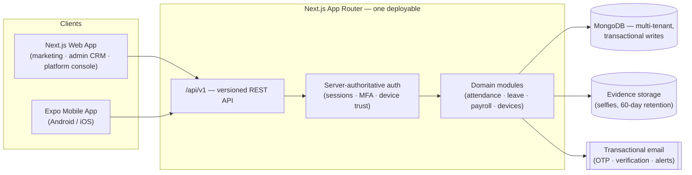

  

<h1 align="center">Presentee</h1>

<b>Smart attendance for modern teams</b>

  
  
  
  
  
  
  

  A full-stack, multi-tenant attendance platform I designed and built end to end — the public
  website, a company admin dashboard, a platform-owner console, a versioned REST API, and a
  native Android/iOS employee app, all sharing one authorization model and one design system.

> **About this README.** Presentee's source lives in a private repository — it's a real,
> paying-customer product, not a public demo. This document is a public-safe walkthrough of what
> it does and how it's built, so it's visible on my profile even though the code isn't. The
> [live product](https://presentee.ashwanitiwari.com) is real and running.

---

## What it does

Presentee replaces the spreadsheet-and-WhatsApp way small and growing companies track who's at
work. An employee checks in and out from a phone; the server — never the client — decides whether
that check-in is valid, using whichever combination of these an admin has switched on:

- **Geofenced GPS** — attendance only counts inside a configured office radius.
- **Selfie evidence** — a live, front-camera photo captured at the moment of check-in, auto-deleted after 60 days.
- **Device binding** — one approved phone per employee; a new phone needs an admin's sign-off.
- **On-device biometric confirmation** — fingerprint or face unlock, verified by the OS, never stored by the server.

Admins get a real-time picture of who's in, who's late, and who's missing, plus the tools to
correct exceptions, manage leave, and run payroll — all from a browser or from the same mobile app
their employees use.

## Who it's for

| Role | What they get |
|---|---|
| **Employee** | One-tap check-in/out, leave requests, attendance history, and push-style in-app alerts — all from Android or iOS. |
| **Company Admin** | A CRM-style web dashboard: employees, live attendance board, leave and device approvals, shifts, payroll, and reports — plus the same approvals available from their phone. |
| **Platform Owner** | A separate, explicitly-authorized console for managing every company on the platform, subscriptions, and support — isolated from tenant data by a completely different authorization path. |

## Architecture

- **One codebase, one deploy.** The marketing site, the admin CRM, the platform console, and the
  versioned API all live in a single Next.js App Router application — no microservice sprawl for a
  product this size.
- **Server-authoritative everything.** Attendance timestamps, geofence checks, and policy
  decisions are all resolved on the server against the database's own clock — the client only
  ever reports what it observed.
- **Strict tenant isolation.** Every query is scoped to a company; a separate, explicitly-granted
  platform-authorization path exists for the operator console, with no implicit escalation between
  the two.
- **Transactional data integrity.** MongoDB runs as a replica set specifically so attendance and
  registration writes that touch multiple collections commit atomically.
- **Native mobile, not a wrapped webview.** The employee/admin app is a real Expo/React Native
  app talking to the same versioned API as the web client.

## Feature highlights

**Attendance & evidence**
Geofenced check-in/out · optional selfie capture with automatic 60-day deletion · on-device
biometric confirmation · one-approved-device-per-employee binding · admin-driven manual attendance
correction with full audit trail · employee-raised manual attendance requests with admin approval.

**Web admin CRM**
Live attendance board with filters · employee directory · shift and geofence configuration ·
leave approvals · device approvals · payroll (late-arrival and overtime priced per hour, not
percentages) · CSV export · in-app notifications.

**Mobile app**
Employee and admin roles in one app · email/password, one-time-code, and MFA-aware sign-in ·
keyboard-safe, filterable attendance history grouped by month · an admin attendance board with
daily/log views and per-employee drill-down · in-app notifications with unread badges · a
self-contained demo mode for App/Play Store reviewers that never touches production data.

**Platform operations**
A separate Super Admin console for managing companies, subscriptions, manual payments, and support
tickets, gated behind its own authorization path and (optionally) hardware/TOTP MFA.

**Engineering practice**
600+ automated tests (unit, integration against a real disposable MongoDB replica set, and
end-to-end browser tests) · a scripted architecture-boundary check that fails the build on an
illegal import · CI-gated deploys to a self-managed VPS in 1–2 minutes · a shared design-token
system enforced across web and mobile so neither surface can invent its own colors or spacing.

## Tech stack

| Layer | Technology |
|---|---|
| Web & API | Next.js 16 (App Router), React 19, TypeScript |
| Mobile | Expo 57, React Native, Expo Router |
| Data | MongoDB (Mongoose), transactional multi-document writes |
| Validation | Zod, shared between client and server |
| Auth | Server-issued sessions, email OTP, TOTP-based MFA, device-bound mobile tokens |
| Testing | Vitest (unit + integration against a real disposable MongoDB replica set), Playwright (E2E) |
| Infra | Self-managed Hostinger VPS, PM2, GitHub Actions CI/CD, rsync-based zero-downtime deploys |

## My role

I designed and built Presentee end to end, solo — product scope, data model, API design, the
admin and platform web applications, the mobile app, the authorization and security model, the
test suite, and the deployment pipeline. It's live, serving real companies today.

---

  
    Source is private. Questions about the product or the build are welcome — reach out.
  

